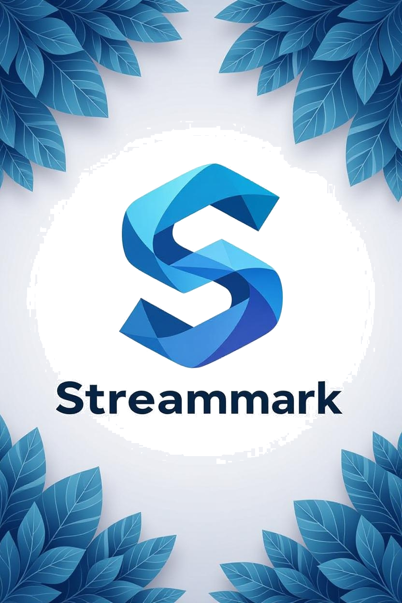
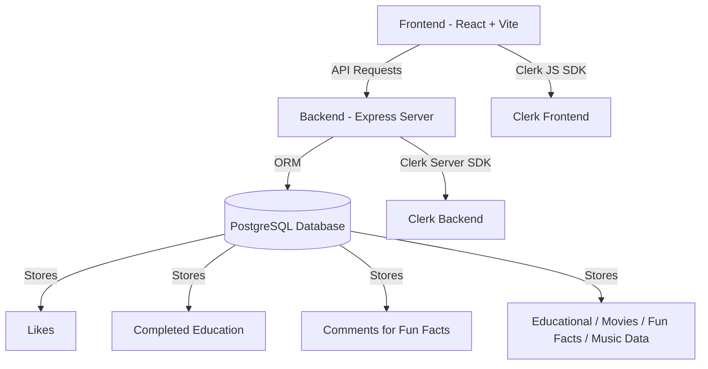

# StreamMark — Full-Stack Application (Frontend + Backend)

<p align="center">
  <a href="https://stream-mark.vercel.app/">
    
  </a>
</p>

<h2 align="center">StreamMark</h2>

<p align="center">
A full-stack platform offering educational videos, movies, music, and fun facts — complete with likes, progress tracking, and user comments in the Fun Facts module.
<br/><br/>
<a href="https://stream-mark.vercel.app/"><strong>View Live App »</strong></a>
<br/><br/>
<a href="https://github.com/OMJPATEL/StreamMark">Frontend Repo</a>
·
<a href="https://github.com/OMJPATEL/streammark-backend">Backend Repo</a>
</p>

---

# 🏅 Badges

<p align="center">
  
  
  
  
  
  
  
  
  
</p>

---

# 📘 Table of Contents

1. About the Project  
2. Live Demo  
3. Tech Stack  
4. System Architecture  
5. Features  
6. Frontend Setup  
7. Backend Setup  
8. Environment Variables  
9. Database Setup & Migrations  
10. API Overview  
11. Project Structure  
12. Contributors  
13. Contact  

---

# 📘 About the Project

StreamMark is a multi-feature platform. Users can:

- Explore educational videos  
- Browse movies  
- Listen to music  
- Read/watch fun facts  
- Like any item across categories  
- Comment on Fun Facts  
- Mark Educational videos as completed  

User security is handled through Clerk authentication.

---

# 🚀 Live Demo

https://stream-mark.vercel.app/

---

# 🛠 Tech Stack

Frontend: React, TS, Vite, Clerk  
Backend: Node, Express, Prisma, PostgreSQL  

---

# 📐 System Architecture



---

# ⭐ Features

Educational: likes + completed tracking  
Fun Facts: likes + comments  
Movies: likes + search  
Music: likes  
Global likes system  
Clerk-secured actions  

---

# 🧩 Frontend Setup

```
git clone https://github.com/OMJPATEL/StreamMark
cd StreamMark
npm install
```

Create `.env`:

```
VITE_CLERK_PUBLISHABLE_KEY=your_key
VITE_API_BASE_URL=http://localhost:3000
```

Run:

```
npm run dev
```

---

# 🧩 Backend Setup

```
git clone https://github.com/OMJPATEL/streammark-backend
cd streammark-backend
npm install
```

`.env`:

```
DATABASE_URL=postgresql://<user>:<password>@localhost:5432/streammark
CLERK_SECRET_KEY=your_clerk_key
PORT=3000
FRONTEND_URL=http://localhost:5173
```

Run:

```
npm run dev
```

---

# 🔐 Environment Variables

Frontend:  
- `VITE_CLERK_PUBLISHABLE_KEY`  
- `VITE_API_BASE_URL`  

Backend:  
- `DATABASE_URL`  
- `CLERK_SECRET_KEY`  
- `PORT`  
- `FRONTEND_URL`  

---

# 🗄 Database Setup & Migrations

```
CREATE DATABASE streammark;
npx prisma migrate dev
npx prisma db seed
```

---

# 🌐 API Overview

Educational: `/educational`  
Movies: `/movies`  
Music: `/music`  
Fun Facts: `/funfacts` + comments  
Likes: `/liked`  
Completed: `/education-progress`  

---

# 🗂 Contributors

Om Patel — Educational Module  
Aakash — Fun Facts  
Akash Kumar — Movies  
Karanveer — Music  

---

# 📬 Contact

LinkedIn: https://www.linkedin.com/in/patelom29  
Live App: https://stream-mark.vercel.app/


---

## 📖 Reference

This project’s README layout was inspired by the open-source template created by @othneildrew.  
Template Link: https://github.com/othneildrew/Best-README-Template
